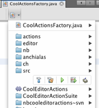
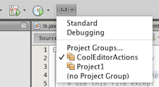
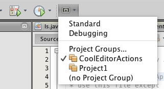
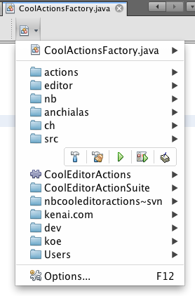
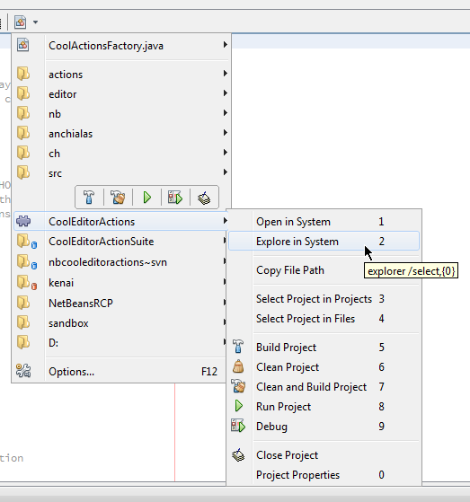
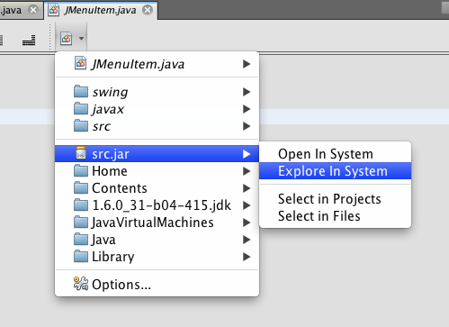
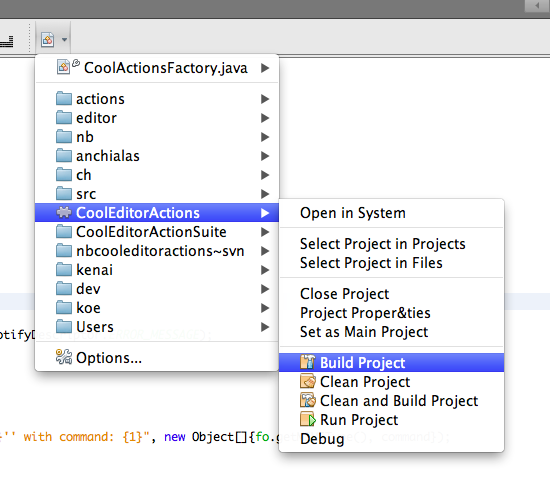

# CoolEditorActions
This Plugin for NetBeans IDE adds two drop down buttons consisting of convenient actions:
  1. to the **Editor Window toolbar**:

     
  1. to the **IDE's toolbar**:

     

## Installation

### Download
  - Download the NBM file from the Releases page
  - Open NetBeans IDE and go to _Tools → Plugins_
  - Select tab _Downloaded_, click _Add plugins..._ and choose downloaded NBM file
  - Click _Install_ button, follow instructions and restart NetBeans IDE
  - Remark: this also configures the _CoolEditorActions Update Center_ for Auto-Update

### Update Center
  - Open NetBeans IDE and go to _Tools → Plugins_
  - Select tab _Settings_ and click _Add_ button
  - Set `CoolEditorActions Update Center` as _Name_,
  `https://github.com/anchialas/CoolEditorActions/raw/master/updates/updates.xml` as _URL_ and click _OK_
  - Select tab _Available Plugins_, search for CoolEditorActions plugin, check _Install_ checkbox
  - Click _Install_ button, follow instructions and restart NetBeans IDE

## Screenshots

